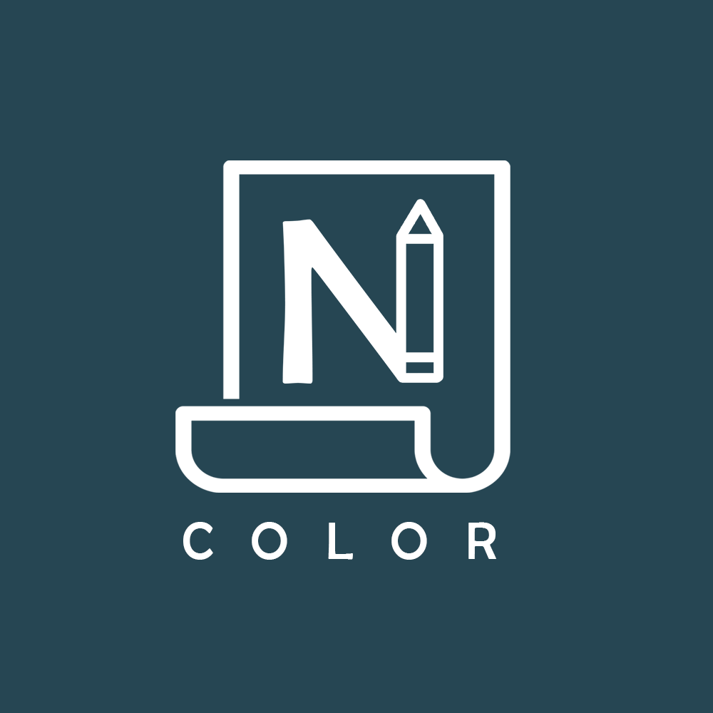

# Color Noter : Desktop

**Version 1.0.0**

**20-08-2021**

Color Noter is a color based note taking app that offer the user the ability to write and save his ideas and todos in an easy to use environment.

_This is a learning project, it is not meant to be published or distributed for the public audiance._

#### Contributors

-    Riadh Adrani (owner) <https://github.com/RiadhAdrani>

#### Technologies

-    Electron Js
-    React Js
-    Javascript HTML & CSS (obviously)
-    Firebase Firestore

#### Available on Android too

Check this repo for the android version : [color-noter-plus](https://github.com/RiadhAdrani/color_note_plus)

## Features

-    Text Note (Up to 5000 characters)
-    ToDo and Check list notes
-    Change application color.
-    Every single note could have a custom color.
-    Synchronize notes
-    Simple User Interface.
-    Dark Theme only because Light Theme sucks !

#### Screenshots

**Login Screen**

**Home Screen**

**Settings Section**
Changing Color only :)

**Color Changing Window**

**About**

**Text Note**

**To do**

